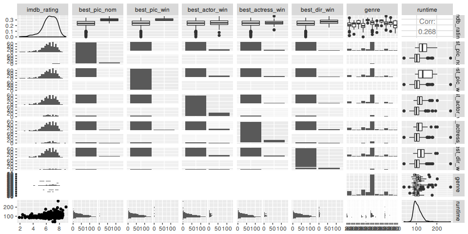
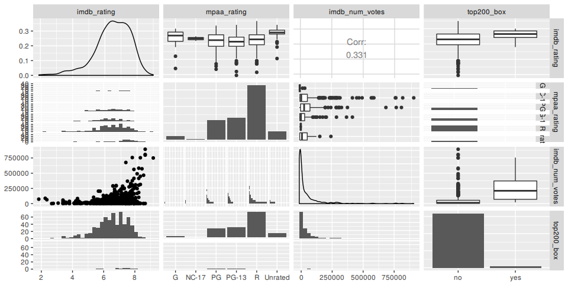

Modeling and prediction for movies
================

Setup
-----

### Load packages

``` r
suppressMessages(library(ggplot2))
suppressMessages(library(dplyr))
suppressMessages(library(statsr))
suppressMessages(library(GGally))
suppressMessages(library(Hmisc))
library(corrgram)
```

### Load data

``` r
setwd(".")
load("movies.Rdata")
```

Part 1: Data
------------

The data set is comprised of 651 randomly sampled movies produced and released before 2016.

Some of these variables are only there for informational purposes and do not make any sense to include in a statistical analysis. It is up to you to decide which variables are meaningful and which should be omitted. For example information in the the actor1 through actor5 variables was used to determine whether the movie casts an actor or actress who won a best actor or actress Oscar.

Based on the research question one will omit certain observations or restructure some of the variables to make them suitable for answering. Furthermore, when fitting a model one should be careful about collinearity, as some of the variables may be dependent on each other.

Part 2: Research question
-------------------------

Is there a association between the data given about a movie and the ratings it got? The focus will be the =imdb\_rating=. Based on that, the other ratings will be removed since there are likely to be highly correlated with =imdb\_rating=.

Part 3: Exploratory data analysis
---------------------------------

First lets select the columns one needs for the study. Remove highly correlated variables.

``` r
cor(movies$imdb_rating, movies$critics_score)
```

    ## [1] 0.7650355

``` r
cor(movies$imdb_rating, movies$audience_score)
```

    ## [1] 0.8648652

Additionally remove columns that are likely not associated with a rating.

``` r
mov <- subset(movies, select = 
                c(imdb_rating, best_pic_nom, 
                  best_pic_win, best_actor_win, 
                  best_actress_win, best_dir_win,
                  genre, runtime, mpaa_rating, 
                  studio, imdb_num_votes, top200_box, 
                  director))
```

``` r
ggpairs(mov, columns = c(1, 2:8))
```

    ## Warning in (function (data, mapping, alignPercent = 0.6, method =
    ## "pearson", : Removing 1 row that contained a missing value

    ## `stat_bin()` using `bins = 30`. Pick better value with `binwidth`.

    ## Warning: Removed 1 rows containing non-finite values (stat_boxplot).

    ## `stat_bin()` using `bins = 30`. Pick better value with `binwidth`.

    ## Warning: Removed 1 rows containing non-finite values (stat_boxplot).

    ## `stat_bin()` using `bins = 30`. Pick better value with `binwidth`.

    ## Warning: Removed 1 rows containing non-finite values (stat_boxplot).

    ## `stat_bin()` using `bins = 30`. Pick better value with `binwidth`.

    ## Warning: Removed 1 rows containing non-finite values (stat_boxplot).

    ## `stat_bin()` using `bins = 30`. Pick better value with `binwidth`.

    ## Warning: Removed 1 rows containing non-finite values (stat_boxplot).

    ## `stat_bin()` using `bins = 30`. Pick better value with `binwidth`.

    ## Warning: Removed 1 rows containing non-finite values (stat_boxplot).

    ## Warning: Removed 1 rows containing missing values (geom_point).

    ## `stat_bin()` using `bins = 30`. Pick better value with `binwidth`.

    ## Warning: Removed 1 rows containing non-finite values (stat_bin).

    ## `stat_bin()` using `bins = 30`. Pick better value with `binwidth`.

    ## Warning: Removed 1 rows containing non-finite values (stat_bin).

    ## `stat_bin()` using `bins = 30`. Pick better value with `binwidth`.

    ## Warning: Removed 1 rows containing non-finite values (stat_bin).

    ## `stat_bin()` using `bins = 30`. Pick better value with `binwidth`.

    ## Warning: Removed 1 rows containing non-finite values (stat_bin).

    ## `stat_bin()` using `bins = 30`. Pick better value with `binwidth`.

    ## Warning: Removed 1 rows containing non-finite values (stat_bin).

    ## `stat_bin()` using `bins = 30`. Pick better value with `binwidth`.

    ## Warning: Removed 1 rows containing non-finite values (stat_bin).

    ## Warning: Removed 1 rows containing non-finite values (stat_density).

 Looking at the first 9 columns, there is only one numerical variable namely runtime. The correlation between =imdb\_rating= and =runtime= is only 0.268 and one can consider these variables as not collinear. Collinearity can change the coefficient estimates erratically in response to small changes in the model or the data. Lets have a look at the remaining data.

``` r
ggpairs(mov, columns = c(1, 9, 11, 12))
```

    ## `stat_bin()` using `bins = 30`. Pick better value with `binwidth`.
    ## `stat_bin()` using `bins = 30`. Pick better value with `binwidth`.
    ## `stat_bin()` using `bins = 30`. Pick better value with `binwidth`.
    ## `stat_bin()` using `bins = 30`. Pick better value with `binwidth`.

 =Studio= and =director= are excluded here because they have a lot of levels and the plot would be "huge". Again many categorical variables and a second numerical the =imdb\_num\_votes=, the correlation coefficient is 0.331 and one can say that there are not highly collinear.

Part 4: Modeling
----------------

For the model selection the forward selection method will be used. There is a lot of data and going backwards would consume too much time. Starting with an empty model one will add one predictor at a time until the parsimonious model is reached. A hybrid approach will be used depending on p-value and adjusted r squared. Lets start with =imdb\_rating= and =runtime=.

``` r
fit <- lm(imdb_rating ~ runtime, mov)
summary(fit)
```

    ## 
    ## Call:
    ## lm(formula = imdb_rating ~ runtime, data = mov)
    ## 
    ## Residuals:
    ##     Min      1Q  Median      3Q     Max 
    ## -4.3099 -0.5791  0.0714  0.7572  2.2500 
    ## 
    ## Coefficients:
    ##             Estimate Std. Error t value Pr(>|t|)    
    ## (Intercept) 4.907873   0.227163  21.605  < 2e-16 ***
    ## runtime     0.014965   0.002111   7.088 3.56e-12 ***
    ## ---
    ## Signif. codes:  0 '***' 0.001 '**' 0.01 '*' 0.05 '.' 0.1 ' ' 1
    ## 
    ## Residual standard error: 1.046 on 648 degrees of freedom
    ##   (1 observation deleted due to missingness)
    ## Multiple R-squared:  0.07195,    Adjusted R-squared:  0.07052 
    ## F-statistic: 50.24 on 1 and 648 DF,  p-value: 3.564e-12

So only 7% can be explained by runtime lets add group of vars namely all oscar related.

``` r
fit <- lm(imdb_rating ~ runtime + best_pic_nom + best_pic_win + best_actor_win + best_actress_win + best_dir_win, mov)
summary(fit)
```

    ## 
    ## Call:
    ## lm(formula = imdb_rating ~ runtime + best_pic_nom + best_pic_win + 
    ##     best_actor_win + best_actress_win + best_dir_win, data = mov)
    ## 
    ## Residuals:
    ##     Min      1Q  Median      3Q     Max 
    ## -4.3254 -0.5522  0.0736  0.6937  2.2356 
    ## 
    ## Coefficients:
    ##                      Estimate Std. Error t value Pr(>|t|)    
    ## (Intercept)          5.157759   0.238568  21.620  < 2e-16 ***
    ## runtime              0.012272   0.002300   5.336 1.32e-07 ***
    ## best_pic_nomyes      0.927229   0.264131   3.510 0.000479 ***
    ## best_pic_winyes      0.003299   0.470185   0.007 0.994404    
    ## best_actor_winyes   -0.073321   0.121562  -0.603 0.546616    
    ## best_actress_winyes -0.026488   0.134492  -0.197 0.843931    
    ## best_dir_winyes      0.258796   0.176979   1.462 0.144147    
    ## ---
    ## Signif. codes:  0 '***' 0.001 '**' 0.01 '*' 0.05 '.' 0.1 ' ' 1
    ## 
    ## Residual standard error: 1.035 on 643 degrees of freedom
    ##   (1 observation deleted due to missingness)
    ## Multiple R-squared:  0.09858,    Adjusted R-squared:  0.09017 
    ## F-statistic: 11.72 on 6 and 643 DF,  p-value: 1.734e-12

Only 2% gained by including the oscar related stuff and the p-values of all of them are pretty high lets remove not significant and add other vars.

``` r
fit <- lm(imdb_rating ~ runtime + best_pic_nom, mov)
summary(fit)$adj.r.squared
```

    ## [1] 0.09199769

Lets add the new variables and see how the model reacts.

``` r
fit <- lm(imdb_rating ~ runtime + best_pic_nom + genre + mpaa_rating + studio,  mov)
summary(fit)$adj.r.squared
```

    ## [1] 0.3473004

As can be noticed from the summary there are factor in genrec mpaa\_rating and studio that are significant and increase the adjusted r squared. Single factors from a category cannot be deleted so one will leave every factor in the model. Now add more of the vars.

``` r
fit <- lm(imdb_rating ~ runtime + best_pic_nom + genre + mpaa_rating + studio + imdb_num_votes, mov)
summary(fit)$adj.r.squared
```

    ## [1] 0.4463403

Based on the adjusted r squared the top200\_box is removed and director is removed because alot of NA's. Now the adjusted r-squared is at 0.4463. Experiments with the =actor= variables showed no significant improvement so the final model is the following.

``` r
fit <- lm(imdb_rating ~ runtime + best_pic_nom + genre + mpaa_rating + studio + imdb_num_votes , mov)
summary(fit)$adj.r.squared
```

    ## [1] 0.4463403

The adjusted r squared for this model is 0.4463 which means 44.6% of the variability of imdb\_ratings can be explained by this model.

Part 5: Prediction
------------------

For prediction we use "Mad Max: Fury Road" that has a 8.1 =imdb\_rating=.

``` r
madmax <- data.frame(runtime=120, best_pic_nom="yes", genre="Action & Adventure", mpaa_rating="R", studio="Warner Bros. Pictures", imdb_num_votes=577247)

predict(fit, madmax)
```

    ## Warning in predict.lm(fit, madmax): prediction from a rank-deficient fit
    ## may be misleading

    ##        1 
    ## 7.996722

The predicted values is 7.99 which is pretty close to 8.1 as reported by the IMDb website.

Part 6: Conclusion
------------------

Only one movie was predicted, to really see if a model is "good" one needs to predict far more movies than one. If it still show good results with much a higher prediction set than one can conclude that the model is reasonable. If the performance degrades, either more or other variables have to be included into the model. Either way it is always a balance act of return on investment.
